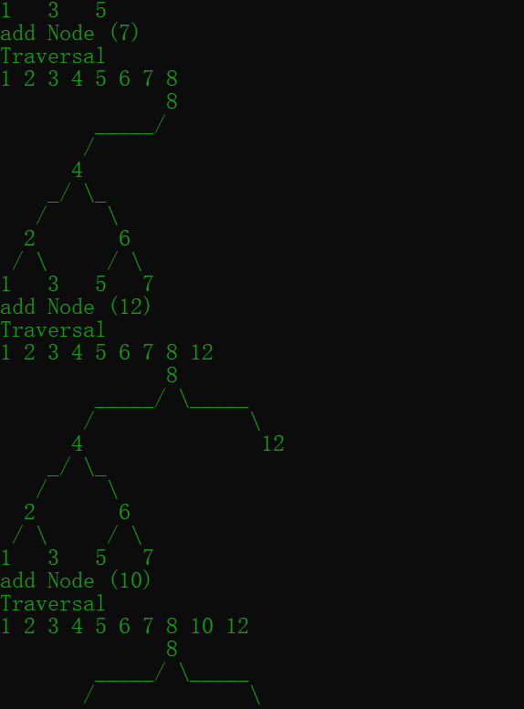
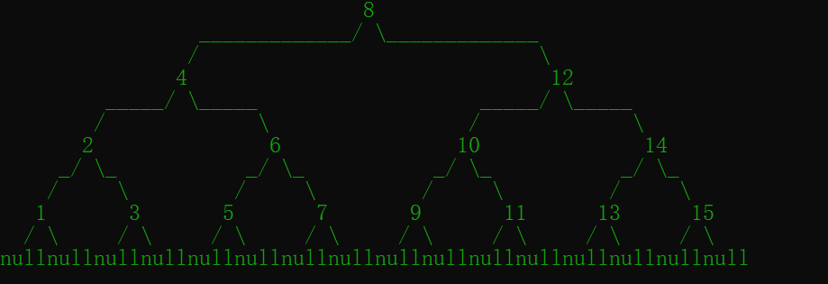

# 一个C++的二叉树打印器

实现参考 Milo Yip https://zhuanlan.zhihu.com/p/38013510

对着大佬的实现加了点代码魔改了一遍

让支持更为广泛 让其对其更加平整

支持C、C++实现的二叉链表实现的二叉树

可以把二叉树打印成一个比较好看的树状 

# 效果图

支持输出Null结点

也可以调整输出树的大小

**具体使用说明在 main中更加详细**

# 缺点

在我的电脑上

输出小一点树的时候 最多只能输出6层的满树

输出大一点的树的 最多输出5层

层次太高了就会导致根本看不懂

就这样吧  勉强还是能用一下

